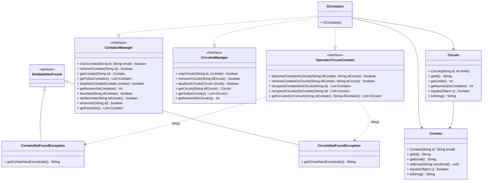

# Círculos


<a href="https://br.freepik.com/fotos-gratis/pessoas-segurando-um-icone-do-google-plus_3682503.htm#fromView=keyword&page=1&position=9&uuid=86316aef-16f6-4b0f-abb9-1e98341a7014&query=Google+Plus">Free Pik</a>

Neste trabalho temos como objetivo implementar um conjunto de classes de modo que elas nos forneçam as funcionalidades 
similares ao conceito de círculos e contatos existentes no finado Google+


## 🎯 Requisitos Funcionais

### Contato

✅ Adicionar um contato
  - Cada contato possui um identificador único (String) e um email.
  - Não pode haver dois contatos com o mesmo identificador. Uma tentativa de cadastro duplicado retorna `false`.

✅ Remover um contato
  - O usuário pode remover um contato informando o seu identificador. Se o contato não existir, retorna `false`.
  - Ao ser removido, o contato também deve sair de todos os círculos dos quais fazia parte e da lista de favoritos.

✅ Atualizar email do contato
  - O usuário pode atualizar o email de um contato informando um objeto `Contato` com o mesmo identificador e o novo email.
  - Se não houver contato cadastrado com esse identificador, retorna `false`.

✅ Buscar um contato
  - O usuário pode recuperar um contato ao informar seu identificador. Se o contato não existir, retorna `null`.
  - O usuário pode listar todos os contatos cadastrados, em ordem alfabética do identificador.

✅ Número de contatos cadastrados
  - O sistema deve retornar a quantidade total de contatos registrados.

✅ Favoritos
  - Deve ser possível favoritar um contato.
  - Deve ser possível desfavoritar um contato.
  - Deve ser possível listar todos os contatos favoritos, em ordem alfabética do identificador.
  - Deve ser possível verificar se um contato é favorito.
  - Favoritar ou desfavoritar um contato que não existe retorna `false`.


### Círculos
✅ Criar um círculo
  - Cada círculo possui um identificador único (String) e um limite de armazenamento de contatos.
  - O limite deve ser maior que zero.
  - Não pode haver dois círculos com o mesmo identificador.
  - Se o limite for inválido ou o identificador já existir, retorna `false`.

✅ Remover um círculo
  - O usuário pode remover um círculo ao informar seu identificador. Se o círculo não existir, retorna `false`.
  - Ao ser removido, o círculo deixa de aparecer na lista de círculos dos contatos que faziam parte dele.

✅ Atualizar o limite de armazenamento
  - O usuário pode aumentar ou reduzir o limite de contatos de um círculo informando um objeto `Circulo` com o mesmo identificador e o novo limite.
  - O novo limite também deve ser maior que zero.
  - O novo limite não pode ser menor que o número de contatos que o círculo já possui.
  - Se o círculo não existir ou o limite for inválido, retorna `false` e o limite atual é mantido.

✅ Buscar um círculo
  - O usuário pode recuperar um círculo pelo seu identificador. Se o círculo não existir, retorna `null`.
  - O usuário pode listar todos os círculos cadastrados, em ordem alfabética do identificador.

✅ Número de círculos cadastrados
  - O sistema deve retornar a quantidade total de círculos registrados.

### Relacionamento entre Círculos e Contatos

Em todas as operações abaixo, se o círculo informado não existir, deve ser lançada uma `CirculoNotFoundException`. Se o contato informado não existir, deve ser lançada uma `ContatoNotFoundException`. Se nenhum dos dois existir, a verificação do círculo vem primeiro.
As exceções devem guardar o identificador que não foi encontrado (`getCirculoNaoEncontrado()` / `getContatoNaoEncontrado()`).

✅ Adicionar um contato em um círculo
  - Só é possível adicionar contatos se o círculo ainda tiver espaço disponível. Caso contrário, retorna `false`.
  - Um contato que já está no círculo não é adicionado novamente e a operação retorna `false`.

✅ Remover um contato de um círculo
  - O usuário pode remover um contato de um círculo. Se o contato não estiver no círculo, retorna `false`.

✅ Listar todos os contatos de um círculo
  - A lista deve estar em ordem alfabética do identificador.

✅ Listar todos os círculos aos quais um contato pertence
  - A lista deve estar em ordem alfabética do identificador.

✅ Listar círculos em comum entre dois contatos
  - O sistema deve retornar a lista de círculos em comum entre dois contatos, em ordem alfabética.
  - Se qualquer um dos contatos informados não existir, lançar `ContatoNotFoundException`.

### Observações sobre `Contato` e `Circulo`
  - Dois contatos são iguais (`equals`) quando têm o mesmo identificador. O mesmo vale para dois círculos.
  - O `toString()` de `Contato` e de `Circulo` deve retornar o identificador. É isso que produz as saídas do exemplo de execução, como `[amigos, familia, trabalho]`.

## 🧱 Diagrama UML


## Exemplo de execução

```java
    GContatos gcont = new GContatos();

    gcont.criarCirculo("familia", 3);
    gcont.criarCirculo("amigos", 2);
    gcont.criarCirculo("trabalho", 3);
    System.out.println(gcont.getTodosCirculos()); // [amigos, familia, trabalho]

    gcont.criarContato("james", "james@email.com");
    gcont.criarContato("mario", "mario@email.com");
    gcont.criarContato("jose", "jose@email.com");
    gcont.criarContato("ana", "ana@email.com");
    gcont.criarContato("joaquim", "joaquim@email.com");
    System.out.println(gcont.getTodosContatos()); // [ana, james, joaquim, jose, mario]

    gcont.adicionarContatoAoCirculo("mario", "familia");
    System.out.println(gcont.recuperarCirculosDoContato("mario")); // [familia]

    gcont.adicionarContatoAoCirculo("james", "trabalho");
    gcont.adicionarContatoAoCirculo("joaquim", "trabalho");
    gcont.adicionarContatoAoCirculo("ana", "trabalho");
    System.out.println(gcont.recuperarContatosDoCirculo("trabalho")); // [ana, james, joaquim]

    gcont.adicionarContatoAoCirculo("james", "amigos");
    gcont.adicionarContatoAoCirculo("mario", "amigos");
    System.out.println(gcont.recuperarContatosDoCirculo("amigos")); // [james, mario]

    System.out.println(gcont.getCirculosEmComum("james", "ana")); // [trabalho]
    System.out.println(gcont.getCirculosEmComum("james", "jose")); // []
    System.out.println(gcont.getCirculosEmComum("james", "mario")); // [amigos]
```
